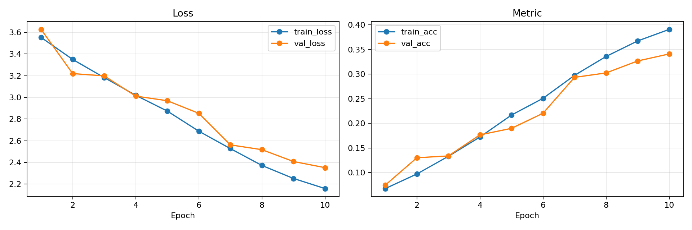
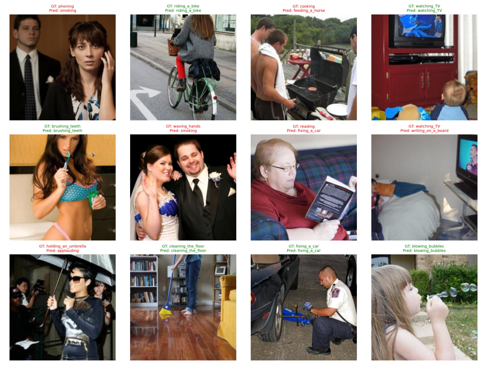

# ResNet Stanford40 Human Action Classification

Stanford40 이미지 데이터셋을 사용해 사람의 행동 class를 분류하는 PyTorch 프로젝트입니다.  
Custom Dataset, ResNet, training/evaluation loop, checkpoint 저장, 학습 curve 및 예측 결과 시각화를 포함합니다.

## Overview

| 항목      | 내용                        |
| --------- | --------------------------- |
| Task      | Human Action Classification |
| Dataset   | Stanford40                  |
| Model     | ResNet-18 / ResNet-34       |
| Loss      | CrossEntropyLoss            |
| Metric    | Accuracy                    |
| Framework | PyTorch                     |

## Result Preview

| 산출물                                              | 설명                                                  |
| --------------------------------------------------- | ----------------------------------------------------- |
| [`history.csv`](assets/results/history.csv)         | epoch별 train/validation loss와 accuracy 기록         |
| [`curves.png`](assets/results/curves.png)           | 학습 과정의 loss/accuracy curve                       |
| [`predictions.png`](assets/results/predictions.png) | validation/test 이미지의 실제 class와 예측 class 비교 |

### Training Curves



### Prediction Examples



### Training History

| epoch | train_loss | train_acc | val_loss | val_acc | lr       |
| ----- | ---------- | --------- | -------- | ------- | -------- |
| 1     | 3.5524     | 0.0675    | 3.6264   | 0.0746  | 0.000976 |
| 2     | 3.3497     | 0.0971    | 3.2191   | 0.1301  | 0.000905 |
| 3     | 3.1825     | 0.1331    | 3.1983   | 0.1338  | 0.000794 |
| 4     | 3.0192     | 0.1722    | 3.0115   | 0.1766  | 0.000655 |
| 5     | 2.8737     | 0.2169    | 2.9691   | 0.1898  | 0.000500 |
| 6     | 2.6882     | 0.2509    | 2.8528   | 0.2205  | 0.000345 |
| 7     | 2.5278     | 0.2976    | 2.5619   | 0.2935  | 0.000206 |
| 8     | 2.3725     | 0.3360    | 2.5179   | 0.3025  | 0.000095 |
| 9     | 2.2526     | 0.3675    | 2.4087   | 0.3268  | 0.000024 |
| 10    | 2.1596     | 0.3909    | 2.3521   | 0.3411  | 0.000000 |

## Features

- Kaggle Stanford40 데이터셋을 PyTorch `Dataset`으로 로딩
- `ImageFolder` 구조와 Stanford40 원본 `JPEGImages` / `ImageSplits` 구조 지원
- train / validation split 자동 구성
- ResNet-18, ResNet-34 직접 구현
- epoch별 train loss, validation loss, accuracy 기록
- validation accuracy 기준 best checkpoint 저장
- loss / metric curve 저장
- test 이미지의 실제 행동 class와 예측 행동 class 비교 시각화

## Project Structure

```text
resnet_stanford40_classification/
├── assets/
│   └── results/
│       ├── curves.png
│       ├── history.csv
│       └── predictions.png
├── configs/
│   └── resnet_stanford40.yaml
├── data/
│   └── stanford40/
├── outputs/
├── scripts/
│   └── check_dataset.py
├── src/
│   ├── common/
│   │   ├── config.py
│   │   ├── metrics.py
│   │   ├── seed.py
│   │   ├── train_utils.py
│   │   └── visualization.py
│   └── stanford40_classification/
│       ├── dataset.py
│       ├── evaluate.py
│       ├── model_resnet.py
│       ├── train.py
│       └── visualize.py
├── README.md
└── requirements.txt
```

## Requirements

```bash
pip install -r requirements.txt
```

Colab에서는 PyTorch가 이미 설치되어 있는 경우가 많으므로, 충돌이 있으면 아래처럼 최소 패키지만 설치해도 됩니다.

```bash
pip install -q pyyaml tqdm matplotlib pillow
```

## Dataset

Kaggle에서 Stanford40 데이터셋을 직접 내려받아 아래 위치에 압축 해제합니다.

```text
resnet_stanford40_classification/data/stanford40/
```

다른 위치에 데이터를 둔 경우 실행할 때 `--data-root`로 경로를 지정할 수 있습니다.

```bash
python -m src.stanford40_classification.train --data-root /path/to/stanford40
```

## Quick Start

먼저 프로젝트 폴더로 이동합니다.

```bash
cd resnet_stanford40_classification
```

데이터셋이 정상적으로 인식되는지 확인합니다.

```bash
python -m scripts.check_dataset --root data/stanford40
```

학습을 실행합니다.

```bash
python -m src.stanford40_classification.train
```

짧게 동작 확인만 할 때는 epoch과 batch size를 줄여 실행할 수 있습니다.

```bash
python -m src.stanford40_classification.train --epochs 2 --batch-size 16
```

평가와 예측 시각화를 실행합니다.

```bash
python -m src.stanford40_classification.evaluate
python -m src.stanford40_classification.visualize
```

## Configuration

실험 설정은 `configs/resnet_stanford40.yaml`에서 관리합니다.

| 설정                  | 의미                                            |
| --------------------- | ----------------------------------------------- |
| `device`              | `auto`이면 GPU가 있으면 CUDA, 없으면 CPU를 사용 |
| `data.root`           | Stanford40 데이터셋 경로                        |
| `data.image_size`     | 입력 이미지 크기                                |
| `data.val_ratio`      | validation split 비율                           |
| `model.name`          | `resnet18` 또는 `resnet34`                      |
| `training.epochs`     | 학습 epoch 수                                   |
| `training.batch_size` | batch size                                      |
| `training.output_dir` | 결과 저장 폴더                                  |

## Outputs

학습을 실행하면 결과는 기본적으로 아래 경로에 저장됩니다.  
이 폴더는 재학습 시 덮어쓰기 또는 append가 발생할 수 있으므로 GitHub에는 올리지 않고, README용 대표 결과는 `assets/results/`에 별도로 보관합니다.

```text
outputs/resnet_stanford40/
├── history.csv
├── curves.png
├── predictions.png
└── checkpoints/
    ├── best.pt
    └── last.pt
```

| 파일              | 설명                                       |
| ----------------- | ------------------------------------------ |
| `history.csv`     | epoch별 loss와 accuracy 기록               |
| `curves.png`      | loss / metric curve                        |
| `predictions.png` | 실제 행동 class와 예측 행동 class 비교     |
| `best.pt`         | validation accuracy가 가장 좋은 checkpoint |
| `last.pt`         | 마지막 epoch checkpoint                    |

README에 표시할 대표 결과를 갱신하려면 학습/시각화가 끝난 뒤 아래 파일만 `assets/results/`로 복사합니다.

```bash
cp outputs/resnet_stanford40/history.csv assets/results/history.csv
cp outputs/resnet_stanford40/curves.png assets/results/curves.png
cp outputs/resnet_stanford40/predictions.png assets/results/predictions.png
```
